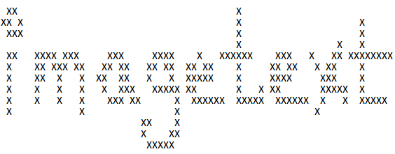

.. gramfuzz documentation master file, created by
   sphinx-quickstart on Sun Dec 11 23:19:53 2016.
   You can adapt this file completely to your liking, but it should at least
   contain the root `toctree` directive.

imagetext - Saving data as visual characters in images
======================================================

imagetext allows one to save and read data as hex characters from
an image.

Data stored in the image is drawn directly into the image data

Installation
^^^^^^^^^^^^

imagetext is available on PyPI and can be installed via pip!

.. code-block:: bash

   pip install imagetext

Examples
^^^^^^^^

Writing to Images via Python
----------------------------

Suppose we want to save the data ``HELLO WORLD`` into an image:

.. code-block:: python

    import imagetext

    data = "HELLO WORLD"
    output_path = "test.png"
    imagetext.write(data, output_path)

That's it!

Below is what the resulting ``test.png`` file looks like:

Reading from Images via Python
------------------------------

To read ``HELLO WORLD`` back out of the image:

.. code-block:: python

   import imagetext

   image_path = "test.png"
   data = imagetext.read(image_path)
   print(data) # prints HELLO WORLD

Stand-Alone Script
------------------

imagetext also comes with a standalone ``imagetext`` script (which is
installed when the module is installed), acts as a command-line utility
that can read/write data to/from PNG images. The script works with pipes,
or command-line arguments:

.. code-block:: text

    usage: imagetext [-h] [-r | -w] [-i INPUT] [-o OUTPUT]

    IMAGETEXT
        by d0c_s4vage

    imagetext is a utility that can write data in hex-form as
    visual characters into an image, and read the raw data back out
    of images.

    Unless specifically told with -r or -w, imagetext automatically
    determines if the input data should be written into an image, or
    if the input data is an image and data should be extracted from
    it.

    Examples:

        echo "HELLO" | imagetext > hello.png
        echo "HELLO" | imagetext -o hello.png
        imagetext -i hello.txt -o hello.png

    optional arguments:
      -h, --help            show this help message and exit
      -r, --read            Input file is an image, read embedded data to output file
      -w, --write           Output file is an image, write data to output image
      -i INPUT, --input INPUT
                            Set the input stream to a file (default=stdin)
      -o OUTPUT, --output OUTPUT
                            Set the output stream to a file (default=stdout)

imagetext Reference Documentation
^^^^^^^^^^^^^^^^^^^^^^^^^^^^^^^^^

.. automodule:: imagetext
   :members:

Indices and tables
==================

* :ref:`genindex`
* :ref:`modindex`
* :ref:`search`
